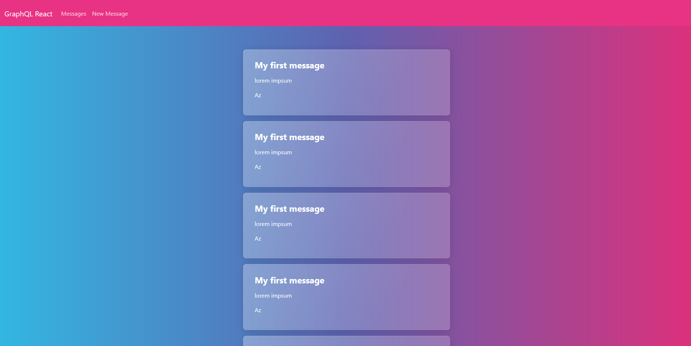
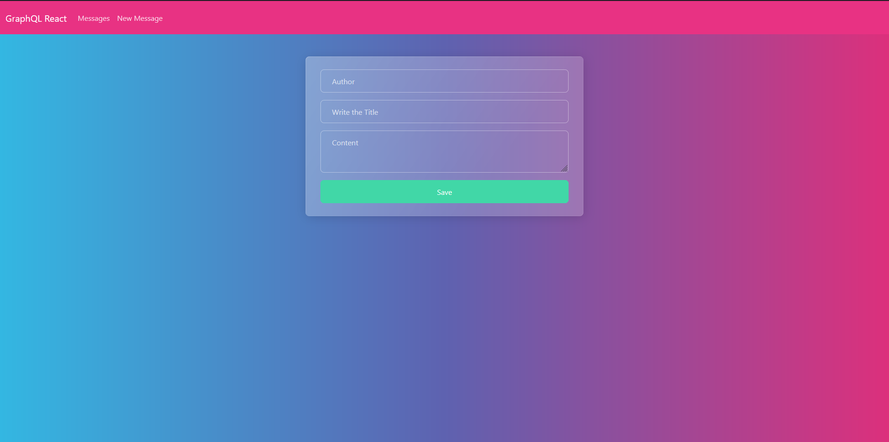
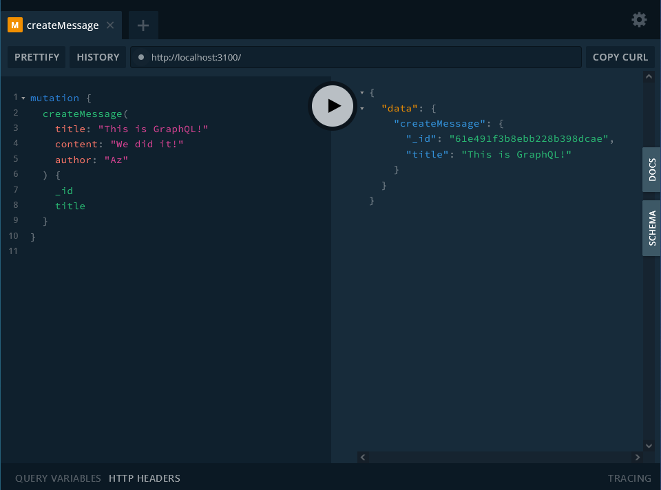

# GraphQL React

A React web application to demonstrate my skills using GraphQL and MongoDB



## Table of contents

- [General info](#general-info)
- [Technologies](#technologies)
- [Setup](#setup)
- [Preview](#preview)
- [Inspiration](#inspiration)

## General info

This project is to add to my portfolio evidence of my GraphQL skills with React

## Technologies

- Bootstrap 5 (5.1.13) (Bootswatch with Quartz style)
- React 17 (17.0.2)
- React Router 6 (6.2.1)
- React Apollo 3 (3.1.5)
- GraphQL 16 (16.2.0)
- MongoDB 5 (5.0.5)

## Setup

To run this project, install it locally using npm:

### Server side (GraphQL with MongoDB)

1. Start your local MongoDB instance
2. Run in a separated terminal:

   ```
   cd backend
   npm i
   npm run build
   npm start
   ```

### Client side (React)

In a separated terminal, run:

```
    cd client
    npm i
    npm start
```

## Site

### New Message Form



### GraphQL API



## Inspiration

This app is inspired by [GraphQL YouTube tutorial](https://www.youtube.com/watch?v=mOXabxAUkzg) from Fazt Code 

Repository ["React GraphQL Yoga Example"](https://github.com/FaztWeb/react-graphql-yoga-example)
